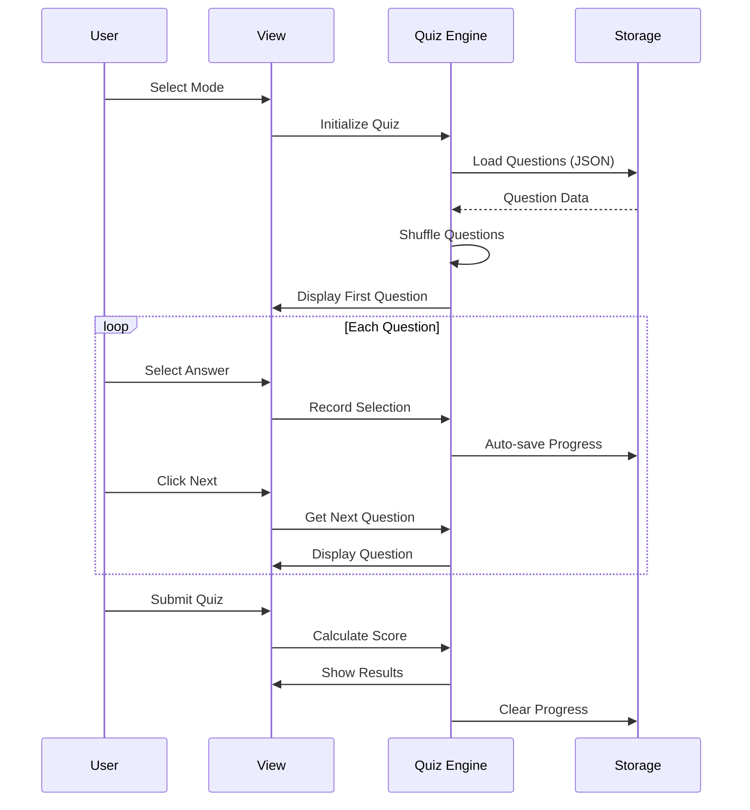
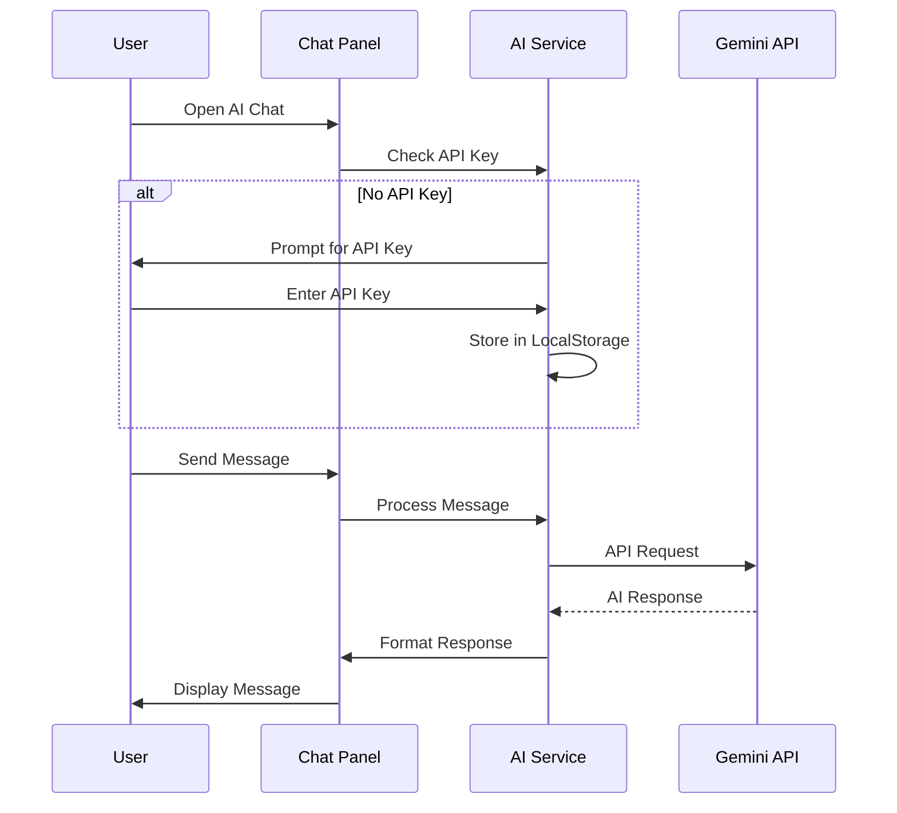

# 🏗 System Architecture

> Technical documentation of the HSB Quiz application architecture

---

## 📊 High-Level Overview

```
┌─────────────────────────────────────────────────────────────────┐
│                         CLIENT (Browser)                         │
├─────────────────────────────────────────────────────────────────┤
│                                                                  │
│  ┌──────────────────────────────────────────────────────────┐   │
│  │                    Presentation Layer                     │   │
│  │  ┌─────────┐  ┌─────────┐  ┌─────────┐  ┌─────────┐     │   │
│  │  │  Home   │  │  Quiz   │  │ Results │  │   AI    │     │   │
│  │  │  View   │  │  View   │  │  View   │  │  Chat   │     │   │
│  │  └────┬────┘  └────┬────┘  └────┬────┘  └────┬────┘     │   │
│  └───────┼────────────┼────────────┼────────────┼───────────┘   │
│          └────────────┼────────────┼────────────┘               │
│                       ▼            ▼                            │
│  ┌──────────────────────────────────────────────────────────┐   │
│  │                    Application Layer                      │   │
│  │                                                           │   │
│  │  ┌─────────────┐  ┌─────────────┐  ┌─────────────┐      │   │
│  │  │    Quiz     │  │   Timer     │  │  Progress   │      │   │
│  │  │   Engine    │  │   System    │  │   Tracker   │      │   │
│  │  └─────────────┘  └─────────────┘  └─────────────┘      │   │
│  │                                                           │   │
│  │  ┌─────────────┐  ┌─────────────┐  ┌─────────────┐      │   │
│  │  │   Theme     │  │    State    │  │Notification │      │   │
│  │  │   Manager   │  │   Manager   │  │   System    │      │   │
│  │  └─────────────┘  └─────────────┘  └─────────────┘      │   │
│  └──────────────────────────────────────────────────────────┘   │
│                              │                                   │
│  ┌───────────────────────────┼──────────────────────────────┐   │
│  │                    Data Layer                             │   │
│  │           ┌───────────────┼───────────────┐              │   │
│  │           ▼               ▼               ▼              │   │
│  │  ┌─────────────┐  ┌─────────────┐  ┌─────────────┐      │   │
│  │  │   Local     │  │    JSON     │  │   Service   │      │   │
│  │  │  Storage    │  │    Files    │  │   Worker    │      │   │
│  │  └─────────────┘  └─────────────┘  └─────────────┘      │   │
│  └──────────────────────────────────────────────────────────┘   │
│                                                                  │
└─────────────────────────────────────────────────────────────────┘
                              │
                              ▼
┌─────────────────────────────────────────────────────────────────┐
│                      EXTERNAL SERVICES                           │
├─────────────────────────────────────────────────────────────────┤
│  ┌─────────────────┐                    ┌─────────────────┐     │
│  │   Google Gemini │                    │     Netlify     │     │
│  │       API       │                    │     Hosting     │     │
│  └─────────────────┘                    └─────────────────┘     │
└─────────────────────────────────────────────────────────────────┘
```

---

## 🧩 Component Breakdown

### 1. Presentation Layer

#### Views

| View | Purpose | File Location |
|------|---------|---------------|
| Home View | Mode selection, subject cards | `index.html` (lines 1-600) |
| Quiz View | Question display, options | `index.html` (lines 600-1200) |
| Results View | Score, review, statistics | `index.html` (lines 1200-1800) |
| AI Chat | Floating chat panel | `index.html` (lines 290-600) |

#### Theme System

```css
:root {
    /* Light mode (default) */
    --bg-primary: #ffffff;
    --text-primary: #0f172a;
}

@media (prefers-color-scheme: dark) {
    :root:not(.light-mode) {
        /* Auto dark mode */
        --bg-primary: #0f172a;
        --text-primary: #f8fafc;
    }
}

body.dark-mode {
    /* Manual dark mode override */
    --bg-primary: #0f172a;
}
```

### 2. Application Layer

#### Quiz Engine

```javascript
// Core quiz logic
const QuizEngine = {
    shuffledQuestions: [],
    currentIndex: 0,
    selections: [],
    
    // Fisher-Yates shuffle for true randomness
    shuffle(array) {
        for (let i = array.length - 1; i > 0; i--) {
            const j = Math.floor(Math.random() * (i + 1));
            [array[i], array[j]] = [array[j], array[i]];
        }
        return array;
    },
    
    // Get questions by filter
    getQuestions(chapter, count) {
        let filtered = this.quizData;
        if (chapter !== 'all') {
            filtered = filtered.filter(q => q.chapter === chapter);
        }
        return this.shuffle([...filtered]).slice(0, count);
    }
};
```

#### Timer System

```javascript
// Timer management
const TimerSystem = {
    timeLeft: 30 * 60, // Default 30 minutes
    timer: null,
    
    start() {
        this.timer = setInterval(() => {
            this.timeLeft--;
            this.updateDisplay();
            
            if (this.timeLeft <= 0) {
                this.stop();
                QuizEngine.submit();
            }
        }, 1000);
    },
    
    stop() {
        clearInterval(this.timer);
    },
    
    updateDisplay() {
        const mins = Math.floor(this.timeLeft / 60);
        const secs = this.timeLeft % 60;
        timerEl.textContent = `${mins}:${secs.toString().padStart(2, '0')}`;
    }
};
```

#### State Manager

```javascript
// Auto-save functionality
const StateManager = {
    STORAGE_KEY: 'hsb2005_quiz_state',
    
    save() {
        const state = {
            currentMode,
            currentIndex,
            shuffledQuestions,
            selections,
            timeLeft,
            timestamp: Date.now()
        };
        localStorage.setItem(this.STORAGE_KEY, JSON.stringify(state));
    },
    
    load() {
        const saved = localStorage.getItem(this.STORAGE_KEY);
        if (!saved) return null;
        
        const state = JSON.parse(saved);
        // Check if state is less than 24 hours old
        if (Date.now() - state.timestamp > 24 * 60 * 60 * 1000) {
            this.clear();
            return null;
        }
        return state;
    },
    
    clear() {
        localStorage.removeItem(this.STORAGE_KEY);
    }
};
```

### 3. Data Layer

#### Data Sources

| Source | Type | Purpose |
|--------|------|---------|
| `questions.json` | Static JSON | Question bank (400+ questions) |
| LocalStorage | Browser API | User progress, preferences |
| Service Worker | PWA Cache | Offline functionality |

#### Question Data Structure

```json
{
    "category": "Tổng quan về CNTT - HSB2005",
    "chapter": "Chương 1",
    "type": "multiple",
    "difficulty": "easy",
    "question": "Thiết bị điện tử nào hoạt động dưới sự điều khiển...",
    "correct_answer": "Máy tính (Computer)",
    "incorrect_answers": [
        "Bộ xử lý (Processor)",
        "Thiết bị đầu vào (Input device)",
        "Thiết bị lưu trữ (Storage device)"
    ],
    "options": [
        "Máy tính (Computer)",
        "Bộ xử lý (Processor)",
        "Thiết bị đầu vào (Input device)",
        "Thiết bị lưu trữ (Storage device)"
    ],
    "pinpoint": "Trang 6: Định nghĩa cơ bản về máy tính."
}
```

---

## 🔄 Data Flow

### Quiz Flow



### AI Chat Flow



---

## 🎨 CSS Architecture

### CSS Custom Properties (Variables)

```css
:root {
    /* Colors */
    --primary-color: #2563eb;
    --success-color: #22c55e;
    --danger-color: #ef4444;
    
    /* Backgrounds */
    --bg-primary: #ffffff;
    --bg-secondary: #f8fafc;
    
    /* Typography */
    --text-primary: #0f172a;
    --text-muted: #475569;
    
    /* Spacing & Sizing */
    --border-radius: 10px;
    --border-radius-lg: 20px;
    
    /* Shadows */
    --shadow-sm: 0 1px 2px rgba(15, 23, 42, 0.08);
    --shadow-md: 0 10px 25px rgba(15, 23, 42, 0.08);
}
```

### Responsive Breakpoints

```css
/* Mobile First */
.container {
    padding: 16px;
}

/* Tablet */
@media (min-width: 768px) {
    .container {
        padding: 32px;
    }
}

/* Desktop */
@media (min-width: 1024px) {
    .container {
        max-width: 920px;
        margin: 0 auto;
    }
}
```

---

## ⚡ Performance Optimizations

### 1. Lazy Loading

```javascript
// Load questions only when needed
async function loadQuestions() {
    const response = await fetch('./questions.json', {
        cache: 'no-cache' // Ensure fresh data
    });
    return response.json();
}
```

### 2. Debounced Save

```javascript
let saveTimeout;
function debouncedSaveProgress() {
    clearTimeout(saveTimeout);
    saveTimeout = setTimeout(() => {
        saveProgress();
    }, 500); // Save after 500ms of inactivity
}
```

### 3. Option Caching

```javascript
// Cache shuffled options to maintain consistency
let shuffledOptionsCache = {};

function getShuffledOptions(questionId, options) {
    if (!shuffledOptionsCache[questionId]) {
        shuffledOptionsCache[questionId] = shuffle([...options]);
    }
    return shuffledOptionsCache[questionId];
}
```

---

## 🔒 Security Considerations

| Concern | Solution |
|---------|----------|
| API Key Exposure | Stored in user's localStorage, not in code |
| XSS Prevention | No dynamic HTML from user input |
| CORS | Same-origin data fetching |
| Data Validation | JSON schema validation on load |

---

## 📱 PWA Features

### Service Worker

```javascript
// sw.js - Cache strategy
const CACHE_NAME = 'hsb-quiz-v2';
const urlsToCache = [
    '/',
    '/index.html',
    '/questions.json',
    '/styles.css',
    '/app.js'
];

self.addEventListener('install', event => {
    event.waitUntil(
        caches.open(CACHE_NAME)
            .then(cache => cache.addAll(urlsToCache))
    );
});
```

### Manifest

```json
{
    "name": "Quiz HSB2005",
    "short_name": "Quiz HSB",
    "start_url": "/",
    "display": "standalone",
    "theme_color": "#2563eb",
    "background_color": "#ffffff"
}
```

---

<div align="center">

**[← Learning Guide](LEARNING_GUIDE.md)** | **[AI Prompts →](AI_PROMPTS.md)**

</div>
